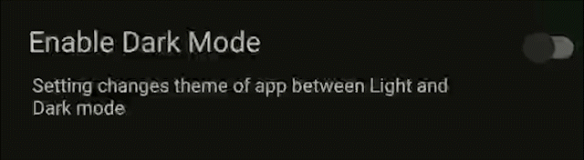

# Settings-UI

A Kotlin library for building user settings interfaces in Android applications.


## Why use this library

- **Easy to use:** The library provides a simple and flexible way to create a settings screen for your Android app,
    with a variety of built-in preference items that can be easily added to the screen.
- **Customizable:** You can customize the appearance and behavior of the SettingsFragment and its preference items by 
    overriding the appropriate styles and attributes in your app's theme.
- **Clean UI:** The library provides a clean and intuitive user interface for the settings screen, 
    with a consistent look and feel across different preference items.
- **Supports multiple preference types:** The library supports various types of preferences, including switches, text input fields,
    dropdown lists, and more.
- **Saves preferences automatically:** The library automatically saves user preferences to Shared Preferences,
    so you don't have to worry about manually storing and retrieving them.
    
 ## Contribution
  Any contributions, large or small, major features, bug fixes, additional language translations,recommendations,
  unit/integration tests are welcomed and appreciated but will be thoroughly reviewed and discussed.

## Installation

To use the library, add the following dependency to your app's `build.gradle` file:

```kotlin
  repositories {
     google()
     mavenCentral()
     maven { url 'https://jitpack.io'}          
  }
```

```kotlin
  implementation 'com.github.Deaths-Door:settings-ui:latest-version'
```


## Usage

To create a settings screen, create a `SettingsFragment` and add it to your app's layout. 
You can then customize the fragment by adding preference items to it using the `addPreference()` method. 
The library provides several types of preference items, such as `SwitchPreference`, `EditTextPreference`, and 
`ListPreference`, which allow you to add a switch, an editable text field, and a dropdown list, respectively, to the 
settings screen. You can also create your own custom preference items by extending the `Preference` class.
Here is an example of how to create a `SettingsFragment` and add some preferences to it:

```kotlin
val settingsFragment = SettingsFragment.newInstance()

settingsFragment.addPreference(
    SwitchPreference(
        context = this,
        title = "Dark Mode",
        summary = "Enable dark mode for a better reading experience",
        key = "dark_mode",
        defaultValue = false
    )
)

settingsFragment.addPreference(
    EditTextPreference(
        context = this,
        title = "Username",
        summary = "Enter your desired username",
        key = "username",
        defaultValue = ""
    )
)
```

## Customization

You can customize the appearance and behavior of the SettingsFragment and its preference items by overriding the
appropriate styles and attributes in your app's theme. Refer to the library's documentation for a full list of available 
styles and attributes which stated is below.

Some commons attributes include ( where this == custom view )


Attributes XML   | Kotlin Code   | Function      |
| -------------  | ------------- | --------------|
| `preferenceName` | ``` this.preferenceName```  | give name of preference where value is saved|
| `key`        | `this.key`  | give key of saved value |

### Switch 



Define in XML


```kotlin
<com.deathsdoor.ui_core.widgets.Switch
        android:layout_width="match_parent"
        android:layout_height="100dp"
        setting:title="Enable Dark Mode"
        setting:shortDescription="This setting changes theme of app"
        setting:detailedDescription="Setting changes theme of app between Light and Dark mode"
        setting:switchChecked="false"
        setting:switchOffColor="@color/purple_500"
        setting:switchOnColor="@color/teal_200"
        setting:key="test"
        setting:preferenceName="pref" />

```

Attributes XML | Kotlin Code   | Function      |
| -------------  | ------------- |--------------|
| `title` |` this.title ` | sets title of switch view |
| `shortDescription` | ` this.shortDescription `| summary of setting description  |
| `detailedDescription` | `this.detailedDescription` | more detailed setting description and if not given default value will be shortDescription  |
| `useShortDescription` | `this.useShortDescription` | force the use of shortDescription |
| `switchChecked` | `this.switchChecked` | should the switch(thumb) be checked|
| `switchOnColor` | `this.switchOnColor` | set switch(thumb) color when switchChecked == true |
| `switchOffColor` | `this.switchOffColor` | set switch(thumb) color when switchChecked == false |


## License

```
Copyright 2022 Aarav Shah

Licensed under the Apache License, Version 2.0 (the "License");
you may not use this file except in compliance with the License.
You may obtain a copy of the License at

    http://www.apache.org/licenses/LICENSE-2.0

Unless required by applicable law or agreed to in writing, software
distributed under the License is distributed on an "AS IS" BASIS,
WITHOUT WARRANTIES OR CONDITIONS OF ANY KIND, either express or implied.
See the License for the specific language governing permissions and
limitations under the License.
```
